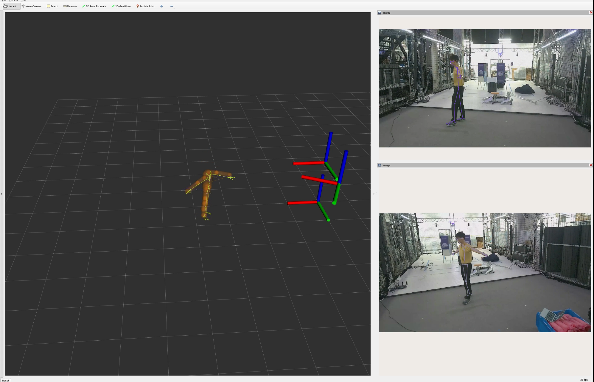

# zedx_driver_ros2

This repository provides bringup and fused body tracking for three ZED X cameras. The cameras are attached to a ZED Box, while the primary compute runs on a more powerful networked computer.

## Usage
The instructions assume you will be splitting compute between the ZED Box and a networked workstation computer with an RTX GPU

The default camera-to-stream mapping matches `src/zed_launcher/calibration/calibration.json`:

| Camera | Serial number | Stream port |
| --- | ---: | ---: |
| `zed_left` | `41235597` | `30000` |
| `zed_center` | `46229474` | `30004` |
| `zed_right` | `49967328` | `30002` |

The server binds each camera by serial number, so USB device enumeration does not affect this mapping.

`body_tracking.launch.xml` enables three-camera, two-tag fusion by default.
Front tag ID 0 and back tag ID 1 are both 12 cm `APRILTAG_36h11` markers.
Each camera first computes a corner-based PnP pose. By default, valid ZED depth
from the same camera grab is then used to refine that pose; if depth is
unavailable or fails validation, the PnP pose remains the fallback. Detections
from the largest agreeing camera set are fused using reprojection quality.
When the two planar IPPE solutions are within 0.25 pixels of one another, the
solution closest to that camera/tag pair's recent pose is selected; a clearly
better reprojection result always wins. This prevents subpixel corner noise
from alternating between the two planar pose hypotheses.
With one visible tag, the learned rigid front-to-back transform supplies the
tag-frame center. With neither visible, the last higher-quality estimate is
held and rebroadcast.

The resulting frame ownership is:

```text
pelvis --static--> tag_frame --dynamic--> fusion_world --static--> cameras
```

The `pelvis -> tag_frame` mounting edge is optional and must be published by
the robot as a static transform. The AprilTag node publishes only the dynamic
`tag_frame -> fusion_world` edge. Each camera edge starts from the relative
pose in `calibration.json`; the ZED SDK supplies the missing live IMU gravity
rotation before the resulting absolute pose is published to TF.
Skeletons and colliders remain message data with
`header.frame_id=fusion_world`; no joint TF tree is generated. The equivalent
pose topic is `/fusion_world_pose_in_tag_frame`.

Before calibration, tag 1 is seeded as 180 degrees about tag 0's local y axis,
with each tag's local +z pointing inward toward the initial center estimate
3 cm away. With `apriltag_learn_tag_transform:=true`, synchronized observations
of both tags bootstrap their full translation and rotation over 2.5 seconds
and at least 30 accepted samples. Keep the rigid tag assembly still with both
tags visible for roughly 2–3 seconds after startup; motion during this window
can delay calibration or make single-tag estimates less accurate until a
consistent bootstrap completes. After bootstrap, conservative bounded online
updates track small mounting changes. The older separation arguments remain
available as compatibility seed/tuning, but full SE(3) calibration is
controlled by `apriltag_learn_tag_transform`.

### Depth-assisted AprilTag pose

Depth assistance is enabled by `apriltag_use_depth:=true`. Depth is retrieved
lazily only for a frame containing a relevant tag detection, and it comes from
the same ZED SDK grab as that color frame. The implementation samples inside
the tag border, fits a robust plane, and accepts the result only when all
configured checks pass:

- Interior sampling excludes a 20% edge margin and requires at least 25 valid
  samples covering 25% of the sampled pixels.
- Plane inliers must be within 15 mm and the fitted plane RMSE must be at most
  10 mm.
- The depth pose must stay within 20 cm and 20 degrees of PnP, and its implied
  tag size must be within 25% of the configured physical size.

An accepted depth estimate is blended with the same frame's PnP estimate using
its plane, coverage, reprojection, size, and PnP-agreement confidence.
Translation and orientation have independent safety weights. For orientation,
depth corrects only the tag-plane normal while retaining PnP's in-plane twist;
this uses stereo depth where it is strongest without importing an unstable
depth-derived rotation about the normal. Both contributions taper smoothly to
zero at their safety limits instead of switching poses abruptly. Debug
overlays report them as `DEPTH T…% R…%`; invalid or insufficient depth reports
`PNP` and keeps the tag detection.

The corresponding launch arguments are
`apriltag_depth_inner_margin_ratio`,
`apriltag_depth_min_valid_samples`,
`apriltag_depth_min_valid_fraction`,
`apriltag_depth_plane_inlier_threshold_m`,
`apriltag_depth_plane_max_rmse_m`,
`apriltag_depth_max_pnp_translation_delta_m`,
`apriltag_depth_max_pnp_rotation_delta_deg`, and
`apriltag_depth_max_size_error_fraction`. IPPE continuity is tuned with
`apriltag_pnp_ambiguity_reprojection_margin_px` and
`apriltag_pnp_prior_max_age_sec`. Setting
`apriltag_use_depth:=false` restores PnP-only estimation.

Full-transform calibration is tuned with
`apriltag_tag_transform_bootstrap_duration_sec` (2.5 s),
`apriltag_tag_transform_bootstrap_min_samples` (30),
`apriltag_tag_transform_pair_max_age_sec` (0.10 s),
`apriltag_tag_transform_bootstrap_translation_outlier_m` (0.03 m),
`apriltag_tag_transform_bootstrap_rotation_outlier_deg` (8 degrees),
`apriltag_tag_transform_online_alpha` (0.01),
`apriltag_tag_transform_max_translation_step_m` (0.002 m), and
`apriltag_tag_transform_max_rotation_step_deg` (0.25 degrees). A measured
front-to-back center baseline can additionally influence orientation through
`apriltag_tag_pair_baseline_orientation_weight`, but it defaults to zero:
with the default 6 cm tag spacing, millimetre-scale position noise becomes
several degrees of angular noise. It is intended only for a substantially
longer, accurately localized baseline.

### Constrained AprilTag motion filter

The published `tag_frame` pose has three dynamic degrees of freedom:
fusion-world `x`, `y`, and yaw. Its fusion-world z coordinate is fixed at
`apriltag_fixed_tag_frame_z_m` (1.0 m by default), and its local +y axis is
reconstructed to point exactly along `fusion_world` -z; equivalently, its
rotation is `Rz(yaw) * Rx(-90 degrees)`. Yaw is obtained by projecting each
fused 6-DoF measurement onto the nearest rotation satisfying that constraint,
using both horizontal tag axes rather than an Euler-angle decomposition.

Temporal filtering uses a constant-velocity Kalman model for
`[x, y, yaw, vx, vy, yaw_rate]`; z and z velocity remain constrained.
Translation and yaw measurements are corrected independently after a
constant-velocity prediction, with wrapped yaw innovations at +/-180 degrees.
Cached detections are never applied twice, brief detection loss holds the last
filtered pose, and a measurement gap over `apriltag_kalman_reset_sec` resets
velocity before tracking resumes.

Filter tuning is exposed through
`apriltag_kalman_position_measurement_std_m` (0.010 m),
`apriltag_kalman_yaw_measurement_std_deg` (1.5 degrees),
`apriltag_kalman_linear_acceleration_std_mps2` (1.0 m/s^2),
`apriltag_kalman_yaw_acceleration_std_degps2` (90 degrees/s^2),
`apriltag_kalman_initial_linear_velocity_std_mps` (1.0 m/s),
`apriltag_kalman_initial_yaw_rate_std_degps` (90 degrees/s), and
`apriltag_kalman_reset_sec` (0.5 s).

The default accuracy profile is `HD1080` at 30 FPS with
`depth_mode:=NEURAL_PLUS`. It preserves more tag pixels and depth samples while
leaving compute headroom for depth, body tracking, and three-camera fusion.
`camera_resolution:=SVGA camera_fps:=60` is available when lower motion latency
matters more, but it makes distant tags smaller, reduces spatial depth
evidence, and doubles the per-second processing load, so it is not the default.

Generate actual-size print files for the default tags with:

```bash
ros2 run zed_launcher generate_apriltag_prints --output-dir ./apriltag_prints
```

This creates one 600-DPI A4 PNG per tag plus a two-page PDF. Print the PDF at
100% / Actual Size with all fit-to-page scaling disabled, then verify the
included 10 cm scale.

### ZED Box Setup
On the ZED Box: 
1. Clone the repository
```
git clone --recursive https://github.com/Abanesjo/zedx_driver_ros2
```
2. Modify the `src/cyclonedds.xml` file with the network / ethernet interface of the ZED Box
3. On the `docker/Dockerfile`, ensure the first line is: 
```
FROM stereolabs/zed:5.3.0-py-devel-l4t-r36.4
```
4. Create the docker container
```
cd docker
docker compose up
```
5. Start the ZED server (within the docker container)
```
docker exec -it zedx_driver_ros2 bash
ros2 launch zed_launcher server.launch.xml
```
6. (Optional) You can run body tracking directly on the ZED Box
```
docker exec -it zedx_driver_ros2 bash
ros2 launch zed_launcher body_tracking.launch.xml debug:=true rviz:=true
```

Now that the jetson/ZED Box is setup, we now launch on the separate compute.
### Networked Workstation Setup
On the Networked Workstation: 
1. Clone the repository
```
git clone --recursive https://github.com/Abanesjo/zedx_driver_ros2
```
2. Modify the `src/cyclonedds.xml` file with the network / ethernet interface of the Workstation
3. On the `docker/Dockerfile`, ensure the first line is: 
```
FROM stereolabs/zed:5.3-gl-devel-cuda12.8-ubuntu22.04
```
4. Create the docker container
```
cd docker
docker compose up
```
5. Start the Body Tracking (within the docker container)
```
docker exec -it zedx_driver_ros2 bash
ros2 launch zed_launcher body_tracking.launch.xml debug:=true rviz:=true
```

Setting `debug:=true` publishes one combined diagnostic image per camera:

```text
/zed_left/zed_node/rgb/color/rect/body_tracking_overlay
/zed_center/zed_node/rgb/color/rect/body_tracking_overlay
/zed_right/zed_node/rgb/color/rect/body_tracking_overlay
```

Each image contains the camera frame, 2D skeleton, and any detected AprilTag
outline, ID, and pose axes. The launch no longer publishes raw camera images
or depth images, nor separate `skeleton_overlay` and `apriltag_overlay` topics.
Pristine color, lazy same-grab depth, and camera calibration stay in-process,
so AprilTag pose fusion continues when `debug:=false` without publishing any
image or depth topics. Disabling debug is recommended for improving
performance.

6. For the human angle calculation and collision capsules, run:
```
docker exec -it zedx_driver_ros2 bash
ros2 launch human_mapping human_mapping.launch.xml
```

This launch publishes the tracked G1 upper-body joint commands on
`/human/joint_commands` and the tracked body/hand capsules on
`/human/colliders`. It replaces the role of `g1_human_manual.launch.xml` for
live tracking; do not run both launches at the same time because they publish
the same topics.

You should see a visualization like below



The axes also show the position of the cameras in the world frame. 

## Calibration
To calibrate the cameras, update `src/zed_launcher/calibration/calibration.json` with the output obtained from the [ZED360](https://www.stereolabs.com/docs/fusion/zed360) tool.
